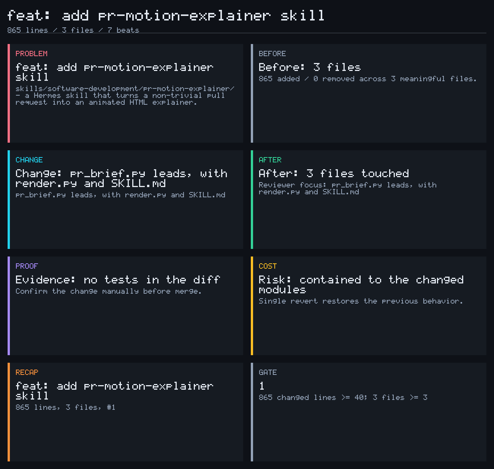

# motion-pr

A Hermes skill that turns a non-trivial pull request into a short animated explainer, so a reviewer gets the shape of a change faster than they can read the diff.

The repository's first PR explains itself: [`docs/explainers/pr-1-pr-motion-explainer.html`](docs/explainers/pr-1-pr-motion-explainer.html) was generated by the scripts in this branch, from PR #1, by this skill.



## What it produces

One self-contained HTML file. No CDN, no build step, no headless browser, no API keys. Inline CSS on a fixed timeline, so it plays offline and is committable next to the code it describes.

Plus the two things GitHub can actually show in a PR comment: a mermaid beat-chain diagram (renders inline in comments and descriptions) and the contact-sheet PNG (renders as an image). The HTML is the full animation; the mermaid and PNG are what the reviewer sees without leaving the PR.

Seven beats, roughly four seconds each:

| Beat | What it says |
|---|---|
| `problem` | the first motivational sentence of the PR body |
| `before` | file count and +/- totals, first hunk of the lead file |
| `change` | the top signal (schema, auth, endpoint, ...) with real added lines |
| `after` | the same file set read as a whole, plus reviewer focus |
| `proof` | test files that shipped with the diff, or a plain "no tests" |
| `cost` | revert path, migration path when the PR is labelled breaking |
| `recap` | one-line summary |

`proof` and `cost` are what keep it from being decoration. A PR with no tests says so on screen, in the beat, not in a footnote.

## Usage

```bash
# 1. gate the diff and build the storyboard
python3 skills/software-development/pr-motion-explainer/scripts/pr_brief.py --pr 123 --out brief.json

# 2. render the animated HTML, plus the mermaid snippet for the PR comment
python3 skills/software-development/pr-motion-explainer/scripts/render.py brief.json --out docs/explainers/pr-123-my-change.html
python3 skills/software-development/pr-motion-explainer/scripts/render.py brief.json --mermaid --out pr-123-mermaid.md

# 3. render the contact-sheet PNG for the PR comment (stdlib only)
python3 skills/software-development/pr-motion-explainer/scripts/poster.py brief.json --out docs/explainers/pr-123-contact-sheet.png
```

For a branch with no PR yet, swap `--pr 123` for `--range origin/main...HEAD`. The beats are identical, only the byline differs.

Exit codes: `0` non-trivial, `3` trivial or empty diff, `1` fetch error. Exit `3` is a valid answer, not a failure.

GitHub will not render inline HTML from a comment, so commit the HTML and link the raw URL. The comment itself should lead with the mermaid diagram and the contact-sheet PNG, both of which GitHub renders natively:

```bash
git add docs/explainers/pr-123-my-change.html docs/explainers/pr-123-contact-sheet.png
git commit -m "docs: add motion explainer for #123"
git push
{ cat pr-123-mermaid.md; echo; echo ""; echo "[Animated explainer](<raw-url-pinned-to-sha>/docs/explainers/pr-123-my-change.html)"; } | gh pr comment 123 --body-file -
```

Pin the URL to the commit SHA. A link on a moving ref changes under the reader if you ever re-render.

## The gate

A PR gets an explainer only if it trips one of these:

- 40 or more changed lines
- 3 or more meaningful files
- a sensitive path: `auth`, `session`, `permissions`, `migrations`, `schema`, `billing`, `payment`, `crypto`, `token`, `cache`, `index`, `query`, `queue`, `worker`, `middleware`, `router`, `entrypoint`, plus `*.sql`, `*.proto`, `*.graphql`, `*.tf`
- a dependency change: `package.json`, lockfiles, `requirements*.txt`, `go.mod`, `Cargo.toml`, `Gemfile`, `composer.json`

Docs, lockfiles, vendor directories, and dotfiles are held out of the file count before lines are counted, so a 900-line lockfile bump stays trivial. The sensitive-path trigger additionally requires 8 or more changed lines, because a one-line typo in `auth.py` is not a story.

The thresholds live in one function, `judge()` in `pr_brief.py`. When one misfires, change it there and say so in the PR thread rather than hand-waving the next one.

`--force` overrides a trivial verdict for cases like a three-line env flip that unblocks a deploy. Say in the comment that you forced it.

## Repository layout

```
skills/software-development/pr-motion-explainer/
  SKILL.md                    the skill itself
  references/
    non-trivial.md            why each gate threshold exists
    publishing.md             where the artifact goes, and the ffmpeg caveat
  scripts/
    pr_brief.py               gate + storyboard, emits brief JSON
    poster.py                 brief JSON -> contact-sheet PNG, no browser needed
    render.py                 brief JSON -> animated HTML
docs/explainers/
  pr-1-pr-motion-explainer.html         animated, 31s
  pr-1-pr-motion-explainer.static.html  all beats stacked, for print
  pr-1-contact-sheet.png                7-frame overview poster
  frames/                                one PNG per beat
```

The skill is also installed at `~/.hermes/skills/software-development/pr-motion-explainer/`, which is where Hermes loads it from. The copy here is the source of record. If the two drift, the installed one wins, so re-copy after editing.

## Verification status

Checked by running it, not by reading it:

| Case | Result |
|---|---|
| docs-only commit | `TRIVIAL`, exit 3, reason names the thresholds missed |
| one-line typo in `src/auth.py` | `TRIVIAL`, exit 3, reason names the thresholds missed |
| 400-line lockfile-only bump | `TRIVIAL`, exit 3, no meaningful files |
| session revocation: 3 files, migration, dependency change | `NON-TRIVIAL`, exit 0, 7 beats |
| PR #1 via `gh` | `NON-TRIVIAL`, 7 beats, 31s |
| all 7 beats at a 577px viewport | one visible card, zero overflow, zero overlap |

Generating this PR's own explainer found four defects that testing against throwaway repos had not: `.gitignore` led every beat because git emits dotfiles first in a fresh diff; the change beat read "logic change spread across the diff" when no path signal matched; markdown from the PR body rendered as literal backticks; and `render.py` used `re` without importing it.

Running the skill against a with-skill/baseline harness found six more, all now fixed:

- `judge()` counted every changed line, including lines in files it had already
  discarded, so a 400-line lockfile bump tripped the 40-line threshold and
  animated anyway. It now counts only meaningful files.
- A `TRIVIAL` verdict reported `too small to animate` with no threshold attached,
  while the skill required telling the reader which one fired. It now reports
  the thresholds the diff came up against.
- The publish path required committing a contact-sheet PNG that no shipped
  script could produce. `poster.py` now generates it in pure stdlib.
- `poster.py`'s first draft wrapped text in characters instead of pixels, so
  headlines overflowed their card, and it rendered non-ASCII as empty boxes.
- The `frames/` recipe was not reproducible from the command it documented.
- `--force` wrote the beats to `brief.json` but still exited `3`, so the
  `pr_brief.py ... && render.py ...` chain the usage docs recommend aborted
  before rendering. A forced run now exits `0`.

Not verified: the mp4 rendering path in `references/publishing.md`. `ffmpeg` is not installed in this environment, so that route is documented but untested.

## Demo assets

`docs/explainers/pr-1-contact-sheet.png` is produced by `poster.py` from `brief.json`. `frames/` holds one PNG per beat, captured at each beat's midpoint by pausing the CSS animations and seeking `currentTime` in a real browser.

```bash
# the poster: stdlib only, reproducible anywhere
python3 skills/software-development/pr-motion-explainer/scripts/poster.py brief.json --out docs/explainers/pr-1-contact-sheet.png

# the animated page and its stacked-for-print variant
python3 skills/software-development/pr-motion-explainer/scripts/render.py brief.json --out docs/explainers/pr-1-pr-motion-explainer.html
python3 skills/software-development/pr-motion-explainer/scripts/render.py brief.json --out docs/explainers/pr-1-pr-motion-explainer.static.html --static
```

`frames/` needs a browser, so those commands do not regenerate it; the poster is the artifact that is. The static build stacks every beat into one scrolling page, which is what you want in a document and unusable as a video source.